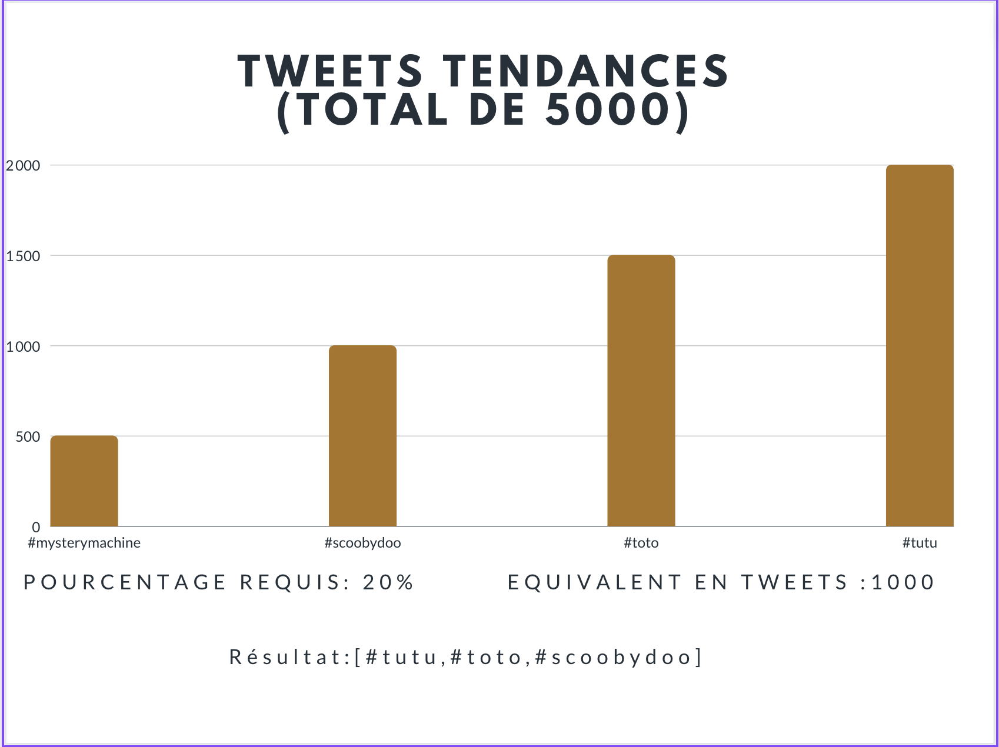
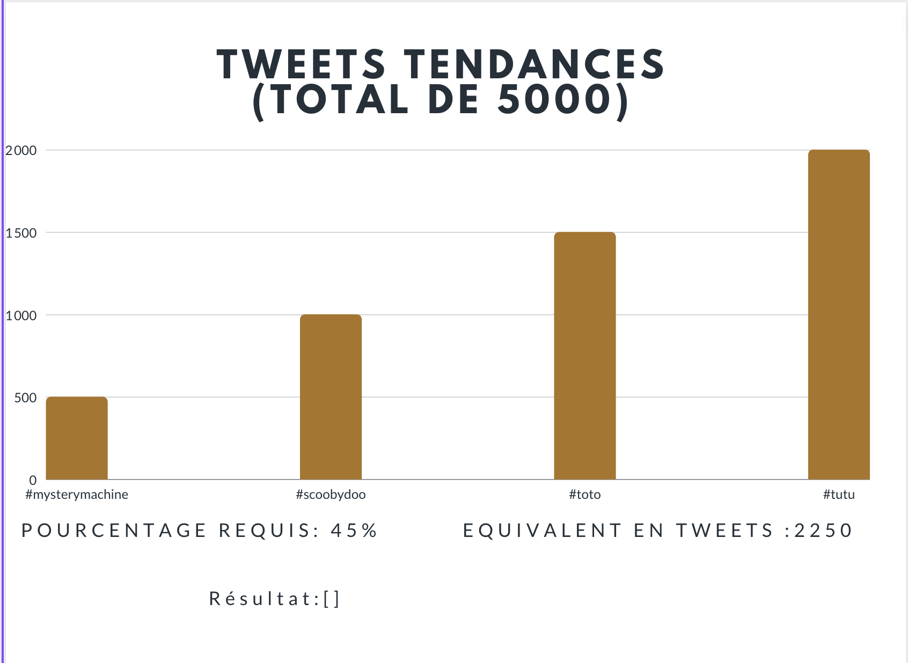

# group-984766 - Alg4

## Step 4 - Tweety One Pilots

## Analyse du contexte:

- Analyse du contenu posté sur un réseau social dans un temps imparti  
- Conversion d'un JSON reçu en argument en une liste de hashtags
- Extraction des hashtags les plus récurrents selon un pourcentage donné
- Ordonnancement de ces hashtags

## Un résumé de votre approche:

- Une fonction se charge dans un premier temps de vérifier la validité du pourcentage reçu dans le JSON
    - Un pourcentage ne peut être négatif
- Une fonction se charge dans un second temps de parcourir chaque tweet et les stocke dans un dictionnaire : 
    - Si le hashtag existe dans le dictionnaire => nous incrémentons sa valeur(ex. "#mysterymachine" => 2)
    - Si le hashtag n'existe pas dans le dicitonnaire => nous l'ajoutons en tant que clé au dicitonnaire et lui passons la valeur de 1 (ex. "#scoobydoo" => 1)
    - Enfin, nous stockons le nombre total de tweets afin d'avoir le bon nombre de récurrences minimales de hashtags pour être présent dans la liste retournée
- Une fonction vérifiant, pour chaque hashtag présent dans le dictionnaire, si son nombre de récurrences est supérieur ou égal au pourcentage donné.
- Ordonnancement des hashtags dont la récurrence est supérieure ou égale au pourcentage donné dans l'ordre décroissant et les retourner dans une liste:
    - Exemple : 
        - Soit : {"#mysterymachine" => 2, "#scoobydoo" => 1, "#toto" => 3}
        - ["#toto", "#mysterymachine", "#scoobydoo"]
- Retouner une liste vide si aucun hashtag n'a un nombre de récurrence supérieur ou égal au pourcentage donné.
- Retourner la liste au format Json

## Exemples

### Exemple 1

### Exemple 2

## Complexité 

### Définition de la complexité algorithmique

En reprenant les desciptions des fonctions citées ci-dessus :  voici leur complexité relative : 
- La fonction chargée de vérifier la validité du poucentage : **O(1)** => checkPercentage
- La fonction chargée dans un seocnd temps de parcourir chaque tweet et les stocker dans un dictionnaire => **T1(n)*T2(n)** => processInputTweetsJson
- La fonction chargée de vérifiée la supériorité ou l'égalité du nombre d'occurrences de ces tweets puis les ordonnance => **T3(n)** => orderData

- Complexité : **T1(n)*t2(n) + T3(n) = n*n + n = n² + n = O(n²)** 

### Remarques et Commentaires

Sur une échelle de 0 à 5, nous avons fixé la complexité à 2.5 car chaque fonction a été réfléchie de sorte à pouvoir contrôler diverses erreurs/exceptions, bien que ces dernières ne soient pas contrôlées par la moulinette.
Grâce à ce procédé, nous avons été capables de contrôler avec précision chaque étape de notre code. 
Retrospective : 
- Comme dit précédemment, les erreurs et exceptions provoquant des erreurs de la moulinette, il nous fallut commenter/enlever des contrôles présents 
    - Exemple : Selon nous, un hashtag valide se doit d'avoir le caractère '#' à sa position 0. Or, ce contrôle provoquait des erreurs de la moulinette . 

La vraie complexité lors de cet exercice fut donc d'arbitrer à quel degré aller dans la complexité.
()
- De plus, une autre complexité a été la problématique d'épargner un calcul du nombre d'oocurrences de hashtags **après** récupération de ceux-ci. Nous y répondîmes avec ce dictionnaire qui, dès lors qu'il lit un hashtag, l'ajoute en tant que clé de ce dictionnaire et lui assigne en tant que valeur le nombre d'occurrences. Ce process nous épargne ainsi un calcul supplémentaire que nous faisions en tout premier lieu.

Une autre réelle complexité fut donc la recherche d'une performance optimale.

